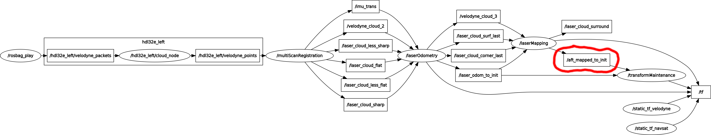

# UTBM Multisensor ROS-based Dataset for Autonomous Driving

## Baselines

 [](https://travis-ci.org/epan-utbm/utbm_robocar_dataset)

We forked the implementation of the following state-of-the-art methods and experimented (with minor changes) with our dataset:

* Lidar odometry: https://github.com/laboshinl/loam_velodyne
* Visual odometry: https://github.com/raulmur/ORB_SLAM2

All users are more than welcome to commit their results.

## Lidar odometry

*Ground-truth trajectories recorded by GPS/RTK*

### How to play

```bash
roslaunch loam_velodyne.launch bag:=path_to_your_rosbag
```

```loam_velodyne.launch``` is [here](loam_velodyne/launch/loam_velodyne.launch).

### Evaluation

First of all, you should have something like this:



Single Velodyne HDL-32E (left)
