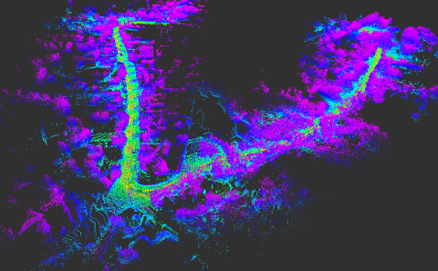
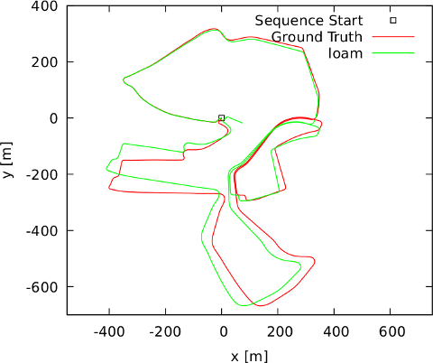
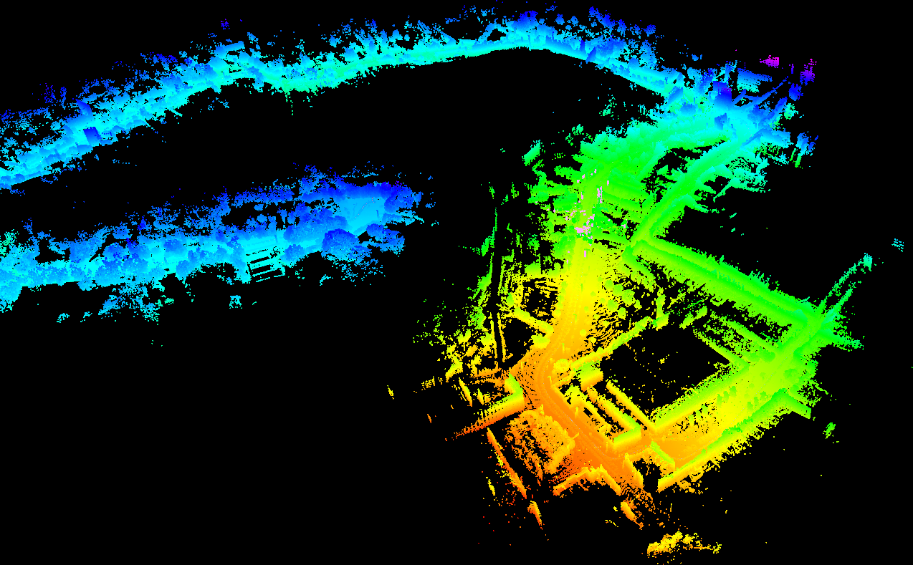
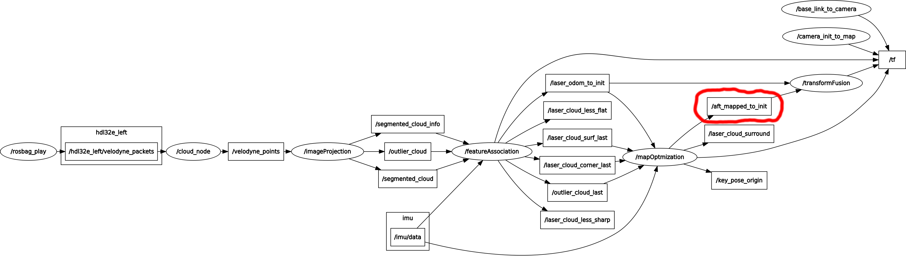

# UTBM Multisensor ROS-based Dataset for Autonomous Driving

[Zhi Yan](https://yzrobot.github.io/), [Li Sun](https://sites.google.com/site/lisunspersonalsite/), [Tomas Krajnik](http://labe.felk.cvut.cz/~tkrajnik/), and [Yassine Ruichek](https://www.researchgate.net/profile/Yassine_Ruichek)

[](https://travis-ci.org/epan-utbm/utbm_robocar_dataset)

## Dataset

[https://epan-utbm.github.io/utbm_robocar_dataset/](https://epan-utbm.github.io/utbm_robocar_dataset/)

## Baselines

We forked the implementation of the following state-of-the-art methods and experimented (with minor changes) with our dataset:

* Lidar odometry: https://github.com/laboshinl/loam_velodyne
* Lidar odometry: https://github.com/RobustFieldAutonomyLab/LeGO-LOAM
* Visual odometry: https://github.com/raulmur/ORB_SLAM2

All users are more than welcome to commit their results.

*Ground-truth trajectories recorded by GPS/RTK*

## loam_velodyne (lidar odometry)



### How to play

```shell
roslaunch loam_velodyne loam_velodyne_utbm.launch bag:=path_to_your_rosbag
```

```loam_velodyne_utbm.launch``` is [here](loam_velodyne/launch/loam_velodyne_utbm.launch).

### Evaluation

First of all, you should have something like this:


Then, ```/aft_mapped_to_init```([nav_msgs/Odometry](http://docs.ros.org/melodic/api/nav_msgs/html/msg/Odometry.html)) is the output lidar odometry that needs to be evaluated.

Single Velodyne HDL-32E (left)



## LeGO-LOAM (lidar odometry)



### How to play

```shell
roslaunch lego_loam lego_loam_utbm.launch bag:=path_to_your_rosbag
```

```lego_loam_utbm.launch``` is [here](LeGO-LOAM/LeGO-LOAM/launch/lego_loam_utbm.launch).

### Evaluation

First of all, you should have something like this:



Then, ```/aft_mapped_to_init```([nav_msgs/Odometry](http://docs.ros.org/melodic/api/nav_msgs/html/msg/Odometry.html)) is the output lidar odometry that needs to be evaluated.

Single Velodyne HDL-32E (left)


